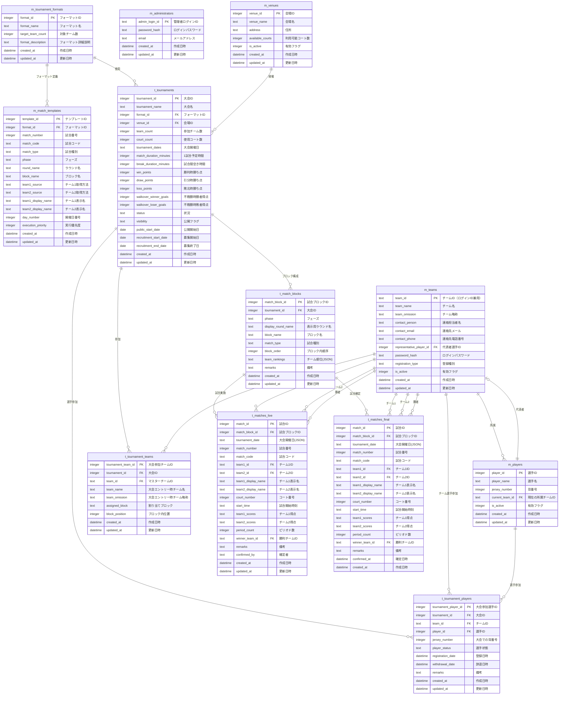

# PK選手権大会 ER図（Mermaid）

以下は、PK選手権大会システムのER図をMermaid記法で表現したものです。

```mermaid
erDiagram
    %% マスターテーブル
    m_venues {
        integer venue_id PK "会場ID"
        text venue_name "会場名"
        text address "住所"
        integer available_courts "利用可能コート数"
        integer is_active "有効フラグ"
        datetime created_at "作成日時"
        datetime updated_at "更新日時"
    }

    m_teams {
        text team_id PK "チームID（ログインID兼用）"
        text team_name "チーム名"
        text team_omission "チーム略称"
        text contact_person "連絡担当者名"
        text contact_email "連絡先メール"
        text contact_phone "連絡先電話番号"
        integer representative_player_id FK "代表者選手ID"
        text password_hash "ログインパスワード"
        text registration_type "登録種別"
        integer is_active "有効フラグ"
        datetime created_at "作成日時"
        datetime updated_at "更新日時"
    }

    m_players {
        integer player_id PK "選手ID"
        text player_name "選手名"
        integer jersey_number "背番号"
        text current_team_id FK "現在の所属チームID"
        integer is_active "有効フラグ"
        datetime created_at "作成日時"
        datetime updated_at "更新日時"
    }

    m_administrators {
        text admin_login_id PK "管理者ログインID"
        text password_hash "ログインパスワード"
        text email "メールアドレス"
        datetime created_at "作成日時"
        datetime updated_at "更新日時"
    }

    m_tournament_formats {
        integer format_id PK "フォーマットID"
        text format_name "フォーマット名"
        integer target_team_count "対象チーム数"
        text format_description "フォーマット詳細説明"
        datetime created_at "作成日時"
        datetime updated_at "更新日時"
    }

    m_match_templates {
        integer template_id PK "テンプレートID"
        integer format_id FK "フォーマットID"
        integer match_number "試合番号"
        text match_code "試合コード"
        text match_type "試合種別"
        text phase "フェーズ"
        text round_name "ラウンド名"
        text block_name "ブロック名"
        text team1_source "チーム1取得方法"
        text team2_source "チーム2取得方法"
        text team1_display_name "チーム1表示名"
        text team2_display_name "チーム2表示名"
        integer day_number "開催日番号"
        integer execution_priority "実行優先度"
        datetime created_at "作成日時"
        datetime updated_at "更新日時"
    }

    %% トランザクションテーブル
    t_tournaments {
        integer tournament_id PK "大会ID"
        text tournament_name "大会名"
        integer format_id FK "フォーマットID"
        integer venue_id FK "会場ID"
        integer team_count "参加チーム数"
        integer court_count "使用コート数"
        text tournament_dates "大会開催日"
        integer match_duration_minutes "1試合予定時間"
        integer break_duration_minutes "試合間空き時間"
        integer win_points "勝利時勝ち点"
        integer draw_points "引分時勝ち点"
        integer loss_points "敗北時勝ち点"
        integer walkover_winner_goals "不戦勝時勝者得点"
        integer walkover_loser_goals "不戦勝時敗者得点"
        text status "状況"
        text visibility "公開フラグ"
        date public_start_date "公開開始日"
        date recruitment_start_date "募集開始日"
        date recruitment_end_date "募集終了日"
        datetime created_at "作成日時"
        datetime updated_at "更新日時"
    }

    t_tournament_teams {
        integer tournament_team_id PK "大会参加チームID"
        integer tournament_id FK "大会ID"
        text team_id FK "マスターチームID"
        text team_name "大会エントリー時チーム名"
        text team_omission "大会エントリー時チーム略称"
        text assigned_block "割り当てブロック"
        integer block_position "ブロック内位置"
        datetime created_at "作成日時"
        datetime updated_at "更新日時"
    }

    t_tournament_players {
        integer tournament_player_id PK "大会参加選手ID"
        integer tournament_id FK "大会ID"
        text team_id FK "チームID"
        integer player_id FK "選手ID"
        integer jersey_number "大会での背番号"
        text player_status "選手状態"
        datetime registration_date "登録日時"
        datetime withdrawal_date "辞退日時"
        text remarks "備考"
        datetime created_at "作成日時"
        datetime updated_at "更新日時"
    }

    t_match_blocks {
        integer match_block_id PK "試合ブロックID"
        integer tournament_id FK "大会ID"
        text phase "フェーズ"
        text display_round_name "表示用ラウンド名"
        text block_name "ブロック名"
        text match_type "試合種別"
        integer block_order "ブロック内順序"
        text team_rankings "チーム順位(JSON)"
        text remarks "備考"
        datetime created_at "作成日時"
        datetime updated_at "更新日時"
    }

    t_matches_live {
        integer match_id PK "試合ID"
        integer match_block_id FK "試合ブロックID"
        text tournament_date "大会開催日(JSON)"
        integer match_number "試合番号"
        text match_code "試合コード"
        text team1_id FK "チーム1ID"
        text team2_id FK "チーム2ID"
        text team1_display_name "チーム1表示名"
        text team2_display_name "チーム2表示名"
        integer court_number "コート番号"
        text start_time "試合開始時刻"
        text team1_scores "チーム1得点"
        text team2_scores "チーム2得点"
        integer period_count "ピリオド数"
        text winner_team_id FK "勝利チームID"
        text remarks "備考"
        text confirmed_by "確定者"
        datetime created_at "作成日時"
        datetime updated_at "更新日時"
    }

    t_matches_final {
        integer match_id PK "試合ID"
        integer match_block_id FK "試合ブロックID"
        text tournament_date "大会開催日(JSON)"
        integer match_number "試合番号"
        text match_code "試合コード"
        text team1_id FK "チーム1ID"
        text team2_id FK "チーム2ID"
        text team1_display_name "チーム1表示名"
        text team2_display_name "チーム2表示名"
        integer court_number "コート番号"
        text start_time "試合開始時刻"
        text team1_scores "チーム1得点"
        text team2_scores "チーム2得点"
        integer period_count "ピリオド数"
        text winner_team_id FK "勝利チームID"
        text remarks "備考"
        datetime confirmed_at "確定日時"
        datetime created_at "作成日時"
    }

    %% リレーションシップ
    m_teams ||--o{ m_players : "所属"
    m_players ||--o| m_teams : "代表者"

    m_tournament_formats ||--o{ m_match_templates : "フォーマット定義"
    m_tournament_formats ||--o{ t_tournaments : "使用"
    m_venues ||--o{ t_tournaments : "開催"

    t_tournaments ||--o{ t_tournament_teams : "参加"
    t_tournaments ||--o{ t_tournament_players : "選手参加"
    t_tournaments ||--o{ t_match_blocks : "ブロック構成"

    m_teams ||--o{ t_tournament_teams : "チーム参加"
    m_teams ||--o{ t_tournament_players : "チーム選手参加"
    m_players ||--o{ t_tournament_players : "選手参加"

    t_match_blocks ||--o{ t_matches_live : "試合実施"
    t_match_blocks ||--o{ t_matches_final : "試合確定"

    m_teams ||--o{ t_matches_live : "チーム1"
    m_teams ||--o{ t_matches_live : "チーム2"
    m_teams ||--o{ t_matches_live : "勝者"

    m_teams ||--o{ t_matches_final : "チーム1"
    m_teams ||--o{ t_matches_final : "チーム2"
    m_teams ||--o{ t_matches_final : "勝者"
```
