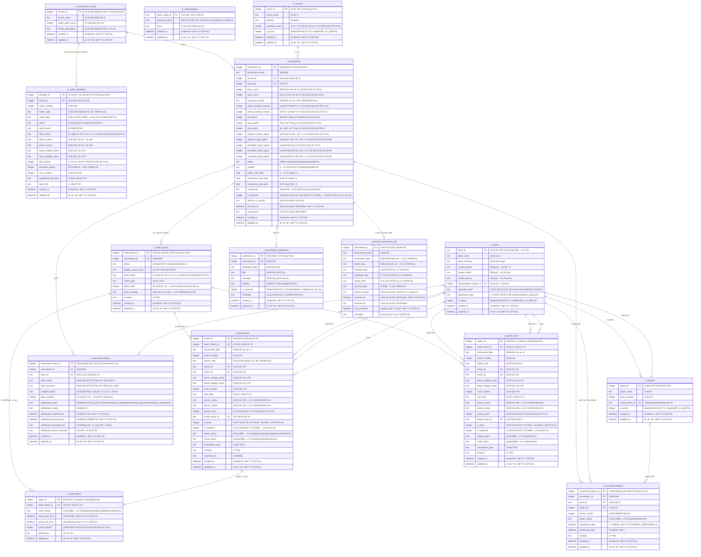

# PKé¸æ‰‹æ¨©å¤§ä¼š ER図（Mermaid）

以下ã¯ã€PKé¸æ‰‹æ¨©å¤§ä¼šã‚·ã‚¹ãƒ†ãƒ ã®ER図をMermaid記法ã§è¡¨ç¾ã—ãŸã‚‚ã®ã§ã™ã€‚

**最終更新**: 2025年8月16日  
**データベース**: Turso（リモートSQLite）  
**アーカイブシステム**: v1.0 JSONå½¢å¼å®Œå…¨å®Ÿè£…  

```mermaid
erDiagram
    %% ãƒã‚¹ã‚¿ãƒ¼ãƒ†ãƒ¼ãƒ–ル
    m_venues {
        integer venue_id PK "会場ID（自動æ¡ç•ªï¼‰"
        text venue_name "会場å"
        text address "ä½æ‰€"
        integer available_courts "利用å¯èƒ½ã‚³ãƒ¼ãƒˆæ•°ï¼ˆãƒ‡ãƒ•ã‚©ãƒ«ãƒˆ4）"
        integer is_active "有効フラグ（1=有効, 0=無効）"
        datetime created_at "作æˆæ—¥æ™‚（JST）"
        datetime updated_at "更新日時（JST）"
    }

    m_teams {
        text team_id PK "ãƒãƒ¼ãƒ ID（ログインID兼用）"
        text team_name "ãƒãƒ¼ãƒ å"
        text team_omission "ãƒãƒ¼ãƒ ç•¥ç§°"
        text contact_person "連絡担当者å"
        text contact_email "連絡先メール"
        text contact_phone "連絡先電話番å·"
        integer representative_player_id FK "代表者é¸æ‰‹ID"
        text password_hash "ログインパスワード（bcryptãƒãƒƒã‚·ãƒ¥ï¼‰"
        text registration_type "登録種別（self_registered/admin_proxy）"
        integer is_active "有効フラグ（1=有効, 0=無効）"
        datetime created_at "作æˆæ—¥æ™‚（JST）"
        datetime updated_at "更新日時（JST）"
    }

    m_players {
        integer player_id PK "é¸æ‰‹ID（自動æ¡ç•ªï¼‰"
        text player_name "é¸æ‰‹å"
        integer jersey_number "背番å·"
        text current_team_id FK "ç¾åœ¨ã®æ‰€å±ãƒãƒ¼ãƒ ID"
        integer is_active "有効フラグ（1=有効, 0=無効）"
        datetime created_at "作æˆæ—¥æ™‚（JST）"
        datetime updated_at "更新日時（JST）"
    }

    m_administrators {
        text admin_login_id PK "管ç†è€…ログインID"
        text password_hash "ログインパスワード（bcryptãƒãƒƒã‚·ãƒ¥ï¼‰"
        text email "メールアドレス"
        datetime created_at "作æˆæ—¥æ™‚（JST）"
        datetime updated_at "更新日時（JST）"
    }

    m_tournament_formats {
        integer format_id PK "フォーãƒãƒƒãƒˆID（自動æ¡ç•ªï¼‰"
        text format_name "フォーãƒãƒƒãƒˆå"
        integer target_team_count "対象ãƒãƒ¼ãƒ æ•°"
        text format_description "フォーãƒãƒƒãƒˆè©³ç´°èª¬æ˜"
        datetime created_at "作æˆæ—¥æ™‚（JST）"
        datetime updated_at "更新日時（JST）"
    }

    m_match_templates {
        integer template_id PK "テンプレートID（自動æ¡ç•ªï¼‰"
        integer format_id FK "フォーãƒãƒƒãƒˆID"
        integer match_number "試åˆç•ªå·"
        text match_code "試åˆã‚³ãƒ¼ãƒ‰ï¼ˆA1, B2, T8ãªã©ï¼‰"
        text match_type "試åˆç¨®åˆ¥ï¼ˆé€šå¸¸, エキシビジョンãªã©ï¼‰"
        text phase "フェーズ（preliminary/final）"
        text round_name "ラウンドå"
        text block_name "ブロックå（A, B, C, D, 決å‹ãƒˆãƒ¼ãƒŠãƒ¡ãƒ³ãƒˆï¼‰"
        text team1_source "ãƒãƒ¼ãƒ 1å–得方法"
        text team2_source "ãƒãƒ¼ãƒ 2å–得方法"
        text team1_display_name "ãƒãƒ¼ãƒ 1表示å"
        text team2_display_name "ãƒãƒ¼ãƒ 2表示å"
        integer day_number "開催日番å·ï¼ˆãƒ‡ãƒ•ã‚©ãƒ«ãƒˆ1）"
        integer execution_priority "実行優先度（0〜）"
        integer court_number "コート番å·"
        text suggested_start_time "æ¨å¥¨é–‹å§‹æ™‚刻"
        text start_time "開始時刻"
        datetime created_at "作æˆæ—¥æ™‚（JST）"
        datetime updated_at "更新日時（JST）"
    }

    %% トランザクションテーブル
    t_tournaments {
        integer tournament_id PK "大会ID（自動æ¡ç•ªï¼‰"
        text tournament_name "大会å"
        integer format_id FK "フォーãƒãƒƒãƒˆID"
        integer venue_id FK "会場ID"
        integer team_count "å‚加ãƒãƒ¼ãƒ æ•°ï¼ˆãƒ‡ãƒ•ã‚©ãƒ«ãƒˆ0）"
        integer court_count "使用コート数（デフォルト4）"
        text tournament_dates "大会開催日（JSONå½¢å¼ï¼‰"
        integer match_duration_minutes "1試åˆäºˆå®šæ™‚間（デフォルト15分）"
        integer break_duration_minutes "試åˆé–“空ã時間（デフォルト5分）"
        integer win_points "å‹åˆ©æ™‚å‹ã¡ç‚¹ï¼ˆãƒ‡ãƒ•ã‚©ãƒ«ãƒˆ3）"
        integer draw_points "引分時å‹ã¡ç‚¹ï¼ˆãƒ‡ãƒ•ã‚©ãƒ«ãƒˆ1）"
        integer loss_points "敗北時å‹ã¡ç‚¹ï¼ˆãƒ‡ãƒ•ã‚©ãƒ«ãƒˆ0）"
        integer walkover_winner_goals "ä¸æˆ¦å‹æ™‚å‹è€…得点（デフォルト3）"
        integer walkover_loser_goals "ä¸æˆ¦å‹æ™‚敗者得点（デフォルト0）"
        integer cancelled_match_points "中止試åˆå‹ã¡ç‚¹ï¼ˆãƒ‡ãƒ•ã‚©ãƒ«ãƒˆ1）"
        integer cancelled_team1_goals "中止試åˆãƒãƒ¼ãƒ 1得点（デフォルト0）"
        integer cancelled_team2_goals "中止試åˆãƒãƒ¼ãƒ 2得点（デフォルト0）"
        text status "状æ³ï¼ˆplanning/ongoing/completed）"
        text visibility "公開フラグ（preparing/public）"
        date public_start_date "公開開始日"
        date recruitment_start_date "募集開始日"
        date recruitment_end_date "募集終了日"
        text created_by "作æˆè€…（デフォルトadmin）"
        integer is_archived "アーカイブ済ã¿ãƒ•ãƒ©ã‚°ï¼ˆ0=通常, 1=アーカイブ済ã¿ï¼‰"
        text archive_ui_version "アーカイブUI版数"
        datetime archived_at "アーカイブ実行日時（JST）"
        text archived_by "アーカイブ実行者"
        datetime created_at "作æˆæ—¥æ™‚（JST）"
        datetime updated_at "更新日時（JST）"
    }

    t_tournament_teams {
        integer tournament_team_id PK "大会å‚加ãƒãƒ¼ãƒ ID（自動æ¡ç•ªï¼‰"
        integer tournament_id FK "大会ID"
        text team_id FK "ãƒã‚¹ã‚¿ãƒ¼ãƒãƒ¼ãƒ ID"
        text team_name "大会エントリー時ãƒãƒ¼ãƒ å"
        text team_omission "大会エントリー時ãƒãƒ¼ãƒ ç•¥ç§°"
        text assigned_block "割り当ã¦ãƒ–ロック（A, B, C, D）"
        integer block_position "ブロック内ä½ç½®ï¼ˆ1〜）"
        text withdrawal_status "è¾é€€ã‚¹ãƒ†ãƒ¼ã‚¿ã‚¹ï¼ˆactive/withdrawal_requested/withdrawal_approved/withdrawal_rejected）"
        text withdrawal_reason "è¾é€€ç†ç”±"
        datetime withdrawal_requested_at "è¾é€€ç”³è«‹æ—¥æ™‚（JST）"
        datetime withdrawal_processed_at "è¾é€€å‡¦ç†å®Œäº†æ—¥æ™‚（JST）"
        text withdrawal_processed_by "è¾é€€å‡¦ç†è€…（管ç†è€…ID）"
        text withdrawal_admin_comment "管ç†è€…コメント"
        datetime created_at "作æˆæ—¥æ™‚（JST）"
        datetime updated_at "更新日時（JST）"
    }

    t_tournament_players {
        integer tournament_player_id PK "大会å‚加é¸æ‰‹ID（自動æ¡ç•ªï¼‰"
        integer tournament_id FK "大会ID"
        text team_id FK "ãƒãƒ¼ãƒ ID"
        integer player_id FK "é¸æ‰‹ID"
        integer jersey_number "大会ã§ã®èƒŒç•ªå·"
        text player_status "é¸æ‰‹çŠ¶æ…‹ï¼ˆactive/withdrawn）"
        datetime registration_date "登録日時（CURRENT_TIMESTAMP）"
        datetime withdrawal_date "è¾é€€æ—¥æ™‚"
        text remarks "備考"
        datetime created_at "作æˆæ—¥æ™‚（JST）"
        datetime updated_at "更新日時（JST）"
    }

    t_match_blocks {
        integer match_block_id PK "試åˆãƒ–ロックID（自動æ¡ç•ªï¼‰"
        integer tournament_id FK "大会ID"
        text phase "フェーズ（preliminary/final）"
        text display_round_name "表示用ラウンドå"
        text block_name "ブロックå（A, B, C, D, 決å‹ãƒˆãƒ¼ãƒŠãƒ¡ãƒ³ãƒˆï¼‰"
        text match_type "試åˆç¨®åˆ¥"
        integer block_order "ブロック内順åºï¼ˆãƒ‡ãƒ•ã‚©ãƒ«ãƒˆ0）"
        text team_rankings "ãƒãƒ¼ãƒ é †ä½æƒ…報（JSONå½¢å¼ï¼‰"
        text remarks "備考"
        datetime created_at "作æˆæ—¥æ™‚（JST）"
        datetime updated_at "更新日時（JST）"
    }

    t_matches_live {
        integer match_id PK "試åˆID（自動æ¡ç•ªï¼‰"
        integer match_block_id FK "試åˆãƒ–ロックID"
        text tournament_date "大会開催日"
        integer match_number "試åˆç•ªå·"
        text match_code "試åˆã‚³ãƒ¼ãƒ‰ï¼ˆA1, B2, T8ãªã©ï¼‰"
        text team1_id FK "ãƒãƒ¼ãƒ 1ID"
        text team2_id FK "ãƒãƒ¼ãƒ 2ID"
        text team1_display_name "ãƒãƒ¼ãƒ 1表示å"
        text team2_display_name "ãƒãƒ¼ãƒ 2表示å"
        integer court_number "コート番å·"
        text start_time "試åˆé–‹å§‹æ™‚刻"
        text team1_scores "ãƒãƒ¼ãƒ 1得点（JSONå½¢å¼ï¼‰"
        text team2_scores "ãƒãƒ¼ãƒ 2得点（JSONå½¢å¼ï¼‰"
        integer period_count "ピリオド数（デフォルト1）"
        text winner_team_id FK "å‹åˆ©ãƒãƒ¼ãƒ ID"
        integer is_draw "引分フラグ（0=å‹æ•—決定, 1=引分）"
        integer is_walkover "ä¸æˆ¦å‹ãƒ•ãƒ©ã‚°ï¼ˆ0=通常, 1=ä¸æˆ¦å‹ï¼‰"
        text match_status "試åˆçŠ¶æ…‹ï¼ˆscheduled/ongoing/completed/cancelled）"
        text result_status "çµæœçŠ¶æ…‹ï¼ˆnone/pending/confirmed）"
        text cancellation_type "中止種別"
        text remarks "備考"
        text confirmed_by "確定者"
        datetime created_at "作æˆæ—¥æ™‚（JST）"
        datetime updated_at "更新日時（JST）"
    }

    t_matches_final {
        integer match_id PK "試åˆID（t_matches_liveã¨åŒä¸€ï¼‰"
        integer match_block_id FK "試åˆãƒ–ロックID"
        text tournament_date "大会開催日"
        integer match_number "試åˆç•ªå·"
        text match_code "試åˆã‚³ãƒ¼ãƒ‰"
        text team1_id FK "ãƒãƒ¼ãƒ 1ID"
        text team2_id FK "ãƒãƒ¼ãƒ 2ID"
        text team1_display_name "ãƒãƒ¼ãƒ 1表示å"
        text team2_display_name "ãƒãƒ¼ãƒ 2表示å"
        integer court_number "コート番å·"
        text start_time "試åˆé–‹å§‹æ™‚刻"
        text team1_scores "ãƒãƒ¼ãƒ 1得点（JSONå½¢å¼ï¼‰"
        text team2_scores "ãƒãƒ¼ãƒ 2得点（JSONå½¢å¼ï¼‰"
        integer period_count "ピリオド数（デフォルト1）"
        text winner_team_id FK "å‹åˆ©ãƒãƒ¼ãƒ ID"
        integer is_draw "引分フラグ（0=å‹æ•—決定, 1=引分）"
        integer is_walkover "ä¸æˆ¦å‹ãƒ•ãƒ©ã‚°ï¼ˆ0=通常, 1=ä¸æˆ¦å‹ï¼‰"
        text match_status "試åˆçŠ¶æ…‹ï¼ˆcompleted）"
        text result_status "çµæœçŠ¶æ…‹ï¼ˆconfirmed）"
        text cancellation_type "中止種別"
        text remarks "備考"
        datetime created_at "作æˆæ—¥æ™‚（JST）"
        datetime updated_at "更新日時（JST）"
    }

    t_match_status {
        integer match_id PK "試åˆID（t_matches_liveã¨åŒä¸€ï¼‰"
        integer match_block_id FK "試åˆãƒ–ロックID"
        text match_status "試åˆçŠ¶æ…‹ï¼ˆscheduled/ongoing/completed/cancelled）"
        datetime actual_start_time "実際ã®é–‹å§‹æ™‚刻（JST）"
        datetime actual_end_time "実際ã®çµ‚了時刻（JST）"
        integer current_period "ç¾åœ¨ã®ãƒ”リオド（デフォルト1）"
        text updated_by "更新者"
        datetime updated_at "更新日時（JST）"
    }

    t_tournament_notifications {
        integer notification_id PK "通知ID（自動æ¡ç•ªï¼‰"
        integer tournament_id FK "大会ID"
        text notification_type "通知種別"
        text title "通知タイトル"
        text message "通知メッセージ"
        text severity "é‡è¦åº¦ï¼ˆinfo/warning/error）"
        integer is_resolved "解決フラグ（0=未解決, 1=解決済ã¿ï¼‰"
        text metadata "メタデータ（JSONå½¢å¼ï¼‰"
        datetime created_at "作æˆæ—¥æ™‚（JST）"
        datetime updated_at "更新日時（JST）"
    }

    %% アーカイブシステム
    t_archived_tournament_json {
        integer tournament_id PK "アーカイブ大会ID"
        text tournament_name "大会å"
        text tournament_data "大会基本情報（JSON）"
        text teams_data "å‚加ãƒãƒ¼ãƒ æƒ…報（JSON）"
        text matches_data "試åˆãƒ‡ãƒ¼ã‚¿ï¼ˆJSON）"
        text standings_data "é †ä½è¡¨ãƒ‡ãƒ¼ã‚¿ï¼ˆJSON）"
        text results_data "戦績表データ（JSON）"
        text pdf_info_data "PDF情報（JSON）"
        text archive_version "アーカイブ版数（v1_json）"
        datetime archived_at "アーカイブ実行日時（JST）"
        text archived_by "アーカイブ実行者"
        datetime last_accessed "最終アクセス日時（JST）"
        text metadata "メタデータ（JSON）"
    }

    %% リレーションシップ
    m_teams ||--o{ m_players : "所å±"
    m_players ||--o| m_teams : "代表者"

    m_tournament_formats ||--o{ m_match_templates : "フォーãƒãƒƒãƒˆå®šç¾©"
    m_tournament_formats ||--o{ t_tournaments : "使用"
    m_venues ||--o{ t_tournaments : "開催"

    t_tournaments ||--o{ t_tournament_teams : "å‚加"
    t_tournaments ||--o{ t_tournament_players : "é¸æ‰‹å‚加"
    t_tournaments ||--o{ t_match_blocks : "ブロック構æˆ"
    t_tournaments ||--o{ t_tournament_notifications : "通知"
    t_tournaments ||--o| t_archived_tournament_json : "アーカイブ化"

    m_teams ||--o{ t_tournament_teams : "ãƒãƒ¼ãƒ å‚加"
    m_teams ||--o{ t_tournament_players : "ãƒãƒ¼ãƒ é¸æ‰‹å‚加"
    m_players ||--o{ t_tournament_players : "é¸æ‰‹å‚加"

    t_match_blocks ||--o{ t_matches_live : "試åˆå®Ÿæ–½"
    t_match_blocks ||--o{ t_matches_final : "試åˆç¢ºå®š"
    t_match_blocks ||--o{ t_match_status : "試åˆçŠ¶æ…‹ç®¡ç†"

    m_teams ||--o{ t_matches_live : "ãƒãƒ¼ãƒ 1"
    m_teams ||--o{ t_matches_live : "ãƒãƒ¼ãƒ 2"
    m_teams ||--o{ t_matches_live : "å‹è€…"

    m_teams ||--o{ t_matches_final : "ãƒãƒ¼ãƒ 1"
    m_teams ||--o{ t_matches_final : "ãƒãƒ¼ãƒ 2"
    m_teams ||--o{ t_matches_final : "å‹è€…"

    t_matches_live ||--|| t_match_status : "状態管ç†"
```

## 🔥 **é‡è¦ãªæ©Ÿèƒ½å®Ÿè£…ãƒã‚¤ãƒ³ãƒˆ**

### **🆠アーカイブシステム（v1.0完全実装済ã¿ï¼‰**
- **目的**: 完了ã—ãŸå¤§ä¼šã®å®Œå…¨ãªãƒ‡ãƒ¼ã‚¿ä¿å­˜ã¨ã‚¢ã‚¯ã‚»ã‚¹
- **データ形å¼**: JSONå½¢å¼ã«ã‚ˆã‚‹å®Œå…¨ãªãƒ‡ãƒ¼ã‚¿æ§‹é€ ä¿å­˜
- **アクセス**: 専用UIã«ã‚ˆã‚‹é«˜é€Ÿè¡¨ç¤ºï¼ˆ`ArchivedLayout_v1.tsx`）
- **データ削除**: アーカイブ後ã®é–¢é€£ãƒ‡ãƒ¼ã‚¿å®‰å…¨å‰Šé™¤

### **🚫 è¾é€€ç®¡ç†ã‚·ã‚¹ãƒ†ãƒ ï¼ˆå®Œå…¨å®Ÿè£…済ã¿ï¼‰**
- **申請フロー**: ãƒãƒ¼ãƒ è¾é€€ç”³è«‹ → 管ç†è€…承èªãƒ»å´ä¸‹
- **影響度評価**: 自動計算ã«ã‚ˆã‚‹å½±éŸ¿åº¦åˆ†æ
- **ステータス管ç†**: `active` → `withdrawal_requested` → `withdrawal_approved/withdrawal_rejected`

### **📋 複数ãƒãƒ¼ãƒ å‚加機能（完全実装済ã¿ï¼‰**
- **複数エントリー**: åŒä¸€ãƒã‚¹ã‚¿ãƒ¼ãƒãƒ¼ãƒ ã‹ã‚‰è¤‡æ•°ã®å¤§ä¼šå‚加
- **個別管ç†**: エントリーæ¯ã®ç‹¬ç«‹ã—ãŸãƒãƒ¼ãƒ å・é¸æ‰‹å‰²ã‚Šå½“ã¦
- **登録種別**: `self_registered`（代表者登録）・`admin_proxy`（管ç†è€…代行）

### **ⰠJST時刻基準**
- **全タイムスタンプ**: `datetime('now', '+9 hours')`ã§JST統一
- **一貫性**: フロントエンド表示ã¨ãƒ‡ãƒ¼ã‚¿ãƒ™ãƒ¼ã‚¹æ™‚刻ã®å®Œå…¨åŒæœŸ

### **🯠順ä½è¡¨ã‚·ã‚¹ãƒ†ãƒ ï¼ˆäº‹å‰è¨ˆç®—å‹ï¼‰**
- **高速表示**: `team_rankings`フィールドã®JSONå½¢å¼ã‚­ãƒ£ãƒƒã‚·ãƒ¥
- **手動調整**: 管ç†è€…ã«ã‚ˆã‚‹æŸ”軟ãªé †ä½ä¿®æ­£æ©Ÿèƒ½
- **決å‹å¯¾å¿œ**: 予é¸ãƒ»æ±ºå‹ãƒˆãƒ¼ãƒŠãƒ¡ãƒ³ãƒˆä¸¡å¯¾å¿œ

### **🔠セキュリティ対応**
- **パスワード**: bcryptãƒãƒƒã‚·ãƒ¥åŒ–
- **èªè¨¼**: NextAuth.js v5ベース
- **JWT**: 審判アクセス用セキュアトークン

## 📊 **データ分離ãƒãƒªã‚·ãƒ¼**

### **ãƒã‚¹ã‚¿ãƒ¼ãƒ‡ãƒ¼ã‚¿ï¼ˆæ°¸ç¶šï¼‰**
- ãƒãƒ¼ãƒ ãƒ»é¸æ‰‹ã®åŸºæœ¬æƒ…å ±ã¯ä¿æŒ
- 大会終了後もãƒã‚¹ã‚¿ãƒ¼ãƒ‡ãƒ¼ã‚¿ã¯ç¶­æŒ

### **トランザクションデータ（大会別）**
- 大会å‚加情報ã¯å¤§ä¼šã”ã¨ã«åˆ†é›¢
- アーカイブ後ã¯é–¢é€£ãƒ‡ãƒ¼ã‚¿å‰Šé™¤å¯èƒ½

### **アーカイブデータ（完全ä¿å­˜ï¼‰**
- 大会ã®å…¨ãƒ‡ãƒ¼ã‚¿ã‚’JSONå½¢å¼ã§å®Œå…¨ä¿å­˜
- 高速アクセスå¯èƒ½ãªå°‚用UIæä¾›